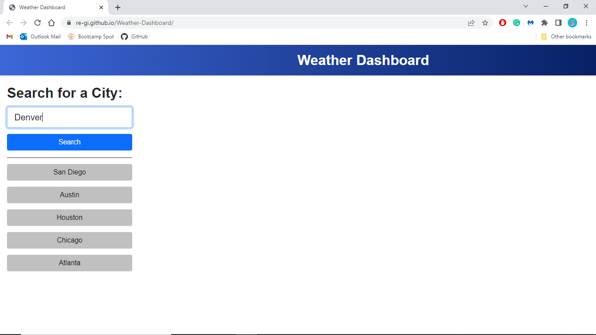
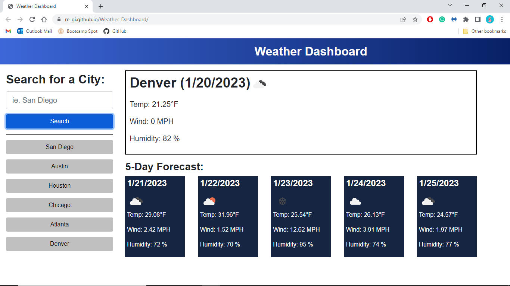
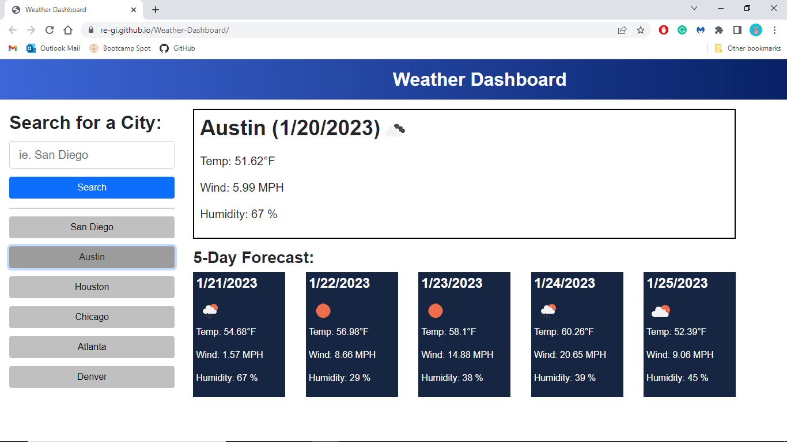

# Weather Dashboard

Visit the deployed application [Here.](https://re-gi.github.io/UTA_Weather-Dashboard/)

## Description
This application displays the current weather and 5-day forecast for a given city. This is a UTA Web Developement Bootcamp challenge for unit 6, made to strengthen my understanding of server-side APIs.

The page loads with only the search form and the user's search history listed below it as buttons. The user can choose to either type in a city and click submit, or click on a previous search to see that city's weather dashboard. The weather dashboard consists of a current weather display and a 5-day forecast display, with all measurements in imperial and each date displaying a weather icon.

The current-weather display is titled by the city's name and current date. Below that is the current temperature, wind speed, and humidity percentage for that city.

The 5-day forecast display shows each of the 5 days in it's own box with that day's date, temperature, wind speed, and humidity percentage.

## Installation
N/A

## Usage
The user should begin by typing a city name into the input box and clicking the 'Search' button to display the weather and 5-day forecast.

To see the current weather and 5-day forecast of a previously searched city, the user should look below the 'Search' button to see all previously searched cities and click on the button with the name of that city.

## Liscense
Refer to liscensing in the project repository.
